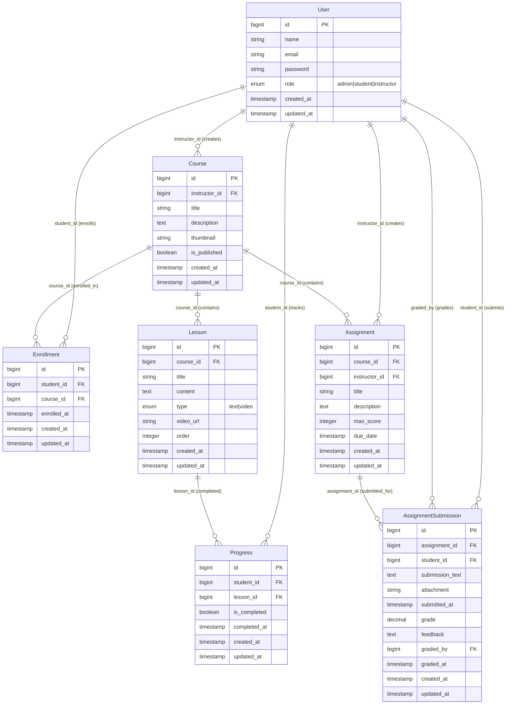

# SproutLMS Architecture Guide – API Developer Edition

This document describes the architecture of SproutLMS from an **API development perspective**. It covers the data model (schema and relationships), request/response patterns, authentication strategies, and how to build RESTful API endpoints that expose the LMS functionality. This guide is tailored for developers building API controllers, mobile app backends, SPA integrations, or third-party integrations.

---

## Table of Contents

1. [High-Level Overview](#high-level-overview)
2. [Domain Model & Database Schema](#domain-model--database-schema)
3. [API Architecture Patterns](#api-architecture-patterns)
4. [Request Flow & Application Layers](#request-flow--application-layers)
5. [API Authentication & Authorization](#api-authentication--authorization)
6. [API Response Patterns](#api-response-patterns)
7. [Building API Endpoints](#building-api-endpoints)
8. [API Testing Strategies](#api-testing-strategies)
9. [Project Structure & Conventions](#project-structure--conventions)
10. [Development Workflow](#development-workflow)
11. [Laravel 11+ Notes](#laravel-11-notes)

---

## High-Level Overview

SproutLMS is a **Laravel 11** application that currently serves **Blade-based web pages** via `routes/web.php`. The application is structured to support adding a **RESTful JSON API layer** without major refactoring.

### Core Domain Model

-   **Admins** manage courses, students, and can assign instructors to courses.
-   **Instructors** create and manage `courses`, `lessons`, and `assignments`. They can grade student submissions.
-   **Students** browse `courses`, enroll via `enrollments`, submit `assignments`, and their lesson completion is tracked via `progress`.
-   **Roles**: `admin`, `student`, and `instructor` are stored on the `users` table (`role` column).

### Current State vs. API Future

**Current (Web-only)**:

-   All routes in `routes/web.php`
-   Session-based authentication
-   Controllers return Blade views
-   Middleware: `auth`, `admin`, `instructor`, `student`

**API Layer (To Be Built)**:

-   Routes in `routes/api.php` (to be created)
-   Token-based authentication (Laravel Sanctum recommended)
-   API controllers return JSON responses
-   Same middleware can be reused with `auth:sanctum` guard
-   Resource transformations for consistent JSON output
-   **Note**: Admin role cannot be registered via public API. Admins must be created manually using Laravel Tinker (see README.md for details).

### Application Flow (API Context)

```text
API Request
  → Route (api.php)
  → Middleware (auth:sanctum / role checks)
  → API Controller (returns JSON)
  → Eloquent Models (User/Course/Lesson/Enrollment/Progress)
  → Resource/Collection (transforms to JSON)
  → JSON Response
```

---

## Domain Model & Database Schema

This section documents the **actual schema and relationships** that API endpoints will expose. Understanding these relationships is critical for building efficient API queries and responses.

### Entity Relationship Diagram



### Schema Details

#### User

-   **Table**: `users` (Laravel default + `role` column)
-   **Key Columns**:
    -   `id` (primary key)
    -   `name`, `email`, `password`
    -   `role`: `enum('admin', 'student', 'instructor')`, default `'student'`
-   **Model**: `App\Models\User`
-   **Relationships**:
    -   `courses(): HasMany<Course>` – courses authored as instructor
    -   `enrollments(): HasMany<Enrollment>` – enrollments as student
    -   `progress(): HasMany<Progress>` – lesson completion records
    -   `assignments(): HasMany<Assignment>` – assignments created as instructor
    -   `assignmentSubmissions(): HasMany<AssignmentSubmission>` – assignments submitted as student
-   **Security Note**: The `admin` role cannot be registered via public registration. Admins must be created manually using Laravel Tinker or database seeders for security reasons.

#### Course

-   **Table**: `courses`
-   **Key Columns**:
    -   `id`, `instructor_id` (FK → `users.id`, cascade delete)
    -   `title`, `description` (nullable), `thumbnail` (nullable)
    -   `is_published` (boolean, default `false`)
-   **Model**: `App\Models\Course`
-   **Relationships**:
    -   `instructor(): BelongsTo<User>`
    -   `lessons(): HasMany<Lesson>` (ordered by `order`)
    -   `enrollments(): HasMany<Enrollment>`
    -   `students(): BelongsToMany<User>` (via `enrollments` pivot)
    -   `assignments(): HasMany<Assignment>` – assignments for this course

#### Lesson

-   **Table**: `lessons`
-   **Key Columns**:
    -   `id`, `course_id` (FK → `courses.id`, cascade delete)
    -   `title`, `content` (nullable), `type` (`enum('text', 'video')`), `video_url` (nullable)
    -   `order` (integer, for sequencing)
-   **Model**: `App\Models\Lesson`
-   **Relationships**:
    -   `course(): BelongsTo<Course>`
    -   `progress(): HasMany<Progress>`

#### Enrollment

-   **Table**: `enrollments`
-   **Key Columns**:
    -   `id`, `student_id` (FK → `users.id`), `course_id` (FK → `courses.id`)
    -   `enrolled_at` (timestamp)
    -   **Unique constraint**: `unique(['student_id', 'course_id'])`
-   **Model**: `App\Models\Enrollment`
-   **Relationships**:
    -   `student(): BelongsTo<User>`
    -   `course(): BelongsTo<Course>`

#### Progress

-   **Table**: `progress`
-   **Key Columns**:
    -   `id`, `student_id` (FK → `users.id`), `lesson_id` (FK → `lessons.id`)
    -   `is_completed` (boolean), `completed_at` (timestamp, nullable)
    -   **Unique constraint**: `unique(['student_id', 'lesson_id'])`
-   **Model**: `App\Models\Progress`
-   **Relationships**:
    -   `student(): BelongsTo<User>`
    -   `lesson(): BelongsTo<Lesson>`

#### Assignment

-   **Table**: `assignments`
-   **Key Columns**:
    -   `id`, `course_id` (FK → `courses.id`, cascade delete), `instructor_id` (FK → `users.id`, cascade delete)
    -   `title`, `description` (nullable), `max_score` (integer, default 100)
    -   `due_date` (timestamp, nullable)
-   **Model**: `App\Models\Assignment`
-   **Relationships**:
    -   `course(): BelongsTo<Course>`
    -   `instructor(): BelongsTo<User>`
    -   `submissions(): HasMany<AssignmentSubmission>`

#### AssignmentSubmission

-   **Table**: `assignment_submissions`
-   **Key Columns**:
    -   `id`, `assignment_id` (FK → `assignments.id`, cascade delete), `student_id` (FK → `users.id`, cascade delete)
    -   `submission_text` (text), `attachment` (string, nullable)
    -   `submitted_at` (timestamp)
    -   `grade` (decimal, nullable), `feedback` (text, nullable)
    -   `graded_by` (FK → `users.id`, nullable), `graded_at` (timestamp, nullable)
    -   **Unique constraint**: `unique(['assignment_id', 'student_id'])` – one submission per student per assignment
-   **Model**: `App\Models\AssignmentSubmission`
-   **Relationships**:
    -   `assignment(): BelongsTo<Assignment>`
    -   `student(): BelongsTo<User>`
    -   `grader(): BelongsTo<User>` (via `graded_by`)

### Relationship Summary

-   **User (admin)** → can manage all courses and students
-   **User (instructor)** → has many `Course`, has many `Assignment`
-   **Course** → has many `Lesson` (ordered), has many `Assignment`
-   **User (student)** → has many `Enrollment` → belongs to many `Course`
-   **User (student)** → has many `Progress` → belongs to many `Lesson`
-   **User (student)** → has many `AssignmentSubmission`
-   **Assignment** → has many `AssignmentSubmission`

---

## API Architecture Patterns

### RESTful Resource Design

SproutLMS follows RESTful conventions:

-   **Resources**: `courses`, `lessons`, `enrollments`, `progress`, `assignments`, `assignment-submissions`
-   **Nested Resources**:
    -   `courses/{course}/lessons/{lesson}`
    -   `courses/{course}/assignments/{assignment}`
    -   `courses/{course}/assignments/{assignment}/submissions/{submission}`
-   **HTTP Methods**: GET (list/show), POST (create), PUT/PATCH (update), DELETE (destroy)
-   **Status Codes**: 200 (success), 201 (created), 400 (bad request), 401 (unauthorized), 403 (forbidden), 404 (not found), 422 (validation error)

### API Versioning Strategy

-   **URL-based versioning**: `/api/v1/courses`, `/api/v2/courses`
-   **Version in routes**: `Route::prefix('api/v1')->group(...)`
-   **Future**: Consider header-based versioning (`Accept: application/vnd.sproutlms.v1+json`)

### Resource Transformation

Use Laravel **API Resources** (`app/Http/Resources/`) to:

-   Control JSON structure
-   Include/exclude fields based on context
-   Add computed fields (e.g., `progress_percentage`)
-   Format relationships consistently

**Example Structure**:

```
app/Http/Resources/
├── CourseResource.php
├── CourseCollection.php
├── LessonResource.php
├── EnrollmentResource.php
├── ProgressResource.php
├── AssignmentResource.php
└── AssignmentSubmissionResource.php
```

### Response Format Standard

All API responses follow this structure:

```json
{
    "success": true,
    "data": {
        // Resource or collection
    },
    "message": "Optional success message",
    "meta": {
        // Pagination, filters, etc.
    }
}
```

Error responses:

```json
{
    "success": false,
    "message": "Error message",
    "errors": {
        "field_name": ["Validation error"]
    }
}
```

---

## Request Flow & Application Layers

### API Request Lifecycle

```text
1. HTTP Request → routes/api.php
2. Middleware Stack:
   - CORS (if needed)
   - Rate Limiting
   - Authentication (auth:sanctum)
   - Role Checks (instructor/student)
3. API Controller:
   - Validate request
   - Authorize action
   - Query models (with eager loading)
   - Transform via Resources
   - Return JSON response
4. JSON Response → Client
```

### Layer Responsibilities

#### Routes (`routes/api.php`)

-   Define API endpoints
-   Apply middleware groups
-   Version prefixes (`/api/v1`)

#### Middleware

-   **Authentication**: `auth:sanctum` (token-based)
-   **Authorization**: Custom `instructor`, `student` middleware (reusable from web)
-   **CORS**: Handle cross-origin requests
-   **Rate Limiting**: Protect endpoints

#### API Controllers (`app/Http/Controllers/Api/`)

-   Handle HTTP methods (index, show, store, update, destroy)
-   Validate input
-   Authorize actions
-   Query models efficiently
-   Return Resource/Collection responses

#### Models (`app/Models/`)

-   Same models used by web controllers
-   Relationships defined for eager loading
-   Scopes for common queries

#### Resources (`app/Http/Resources/`)

-   Transform models to JSON
-   Control field visibility
-   Include relationships conditionally

---

## API Authentication & Authorization

### Authentication Strategy: Laravel Sanctum

**Recommended**: Use Laravel Sanctum for API authentication.

#### Setup

```bash
composer require laravel/sanctum
php artisan vendor:publish --provider="Laravel\Sanctum\SanctumServiceProvider"
php artisan migrate
```

#### User Model Setup

```php
// app/Models/User.php
use Laravel\Sanctum\HasApiTokens;

class User extends Authenticatable
{
    use HasApiTokens, HasFactory, Notifiable;
    // ...
}
```

#### Token Generation

**Login endpoint** (`POST /api/v1/login`):

```php
public function login(Request $request)
{
    $request->validate([
        'email' => 'required|email',
        'password' => 'required',
    ]);

    if (Auth::attempt($request->only('email', 'password'))) {
        $user = Auth::user();
        $token = $user->createToken('api-token')->plainTextToken;

        return response()->json([
            'success' => true,
            'data' => [
                'user' => new UserResource($user),
                'token' => $token,
            ],
        ]);
    }

    return response()->json([
        'success' => false,
        'message' => 'Invalid credentials',
    ], 401);
}
```

#### Token Usage

Clients include token in `Authorization` header:

```
Authorization: Bearer {token}
```

#### Protecting Routes

```php
// routes/api.php
Route::middleware('auth:sanctum')->group(function () {
    Route::get('/courses', [Api\CourseController::class, 'index']);
    // ...
});
```

### Authorization Patterns

#### Role-Based Middleware

Reuse existing middleware with Sanctum:

```php
// bootstrap/app.php (already configured)
$middleware->alias([
    'admin' => \App\Http\Middleware\EnsureUserIsAdmin::class,
    'instructor' => \App\Http\Middleware\EnsureUserIsInstructor::class,
    'student' => \App\Http\Middleware\EnsureUserIsStudent::class,
]);

// routes/api.php
Route::middleware(['auth:sanctum', 'instructor'])->group(function () {
    Route::post('/courses', [Api\CourseController::class, 'store']);
});

Route::middleware(['auth:sanctum', 'admin'])->group(function () {
    Route::get('/admin/students', [Api\AdminController::class, 'students']);
});
```

#### Ownership Checks in Controllers

```php
public function update(Course $course, Request $request)
{
    // Check ownership
    if (Auth::id() !== $course->instructor_id) {
        return response()->json([
            'success' => false,
            'message' => 'Unauthorized',
        ], 403);
    }

    // Update logic...
}
```

---

## API Response Patterns

### Success Responses

#### Single Resource

```json
{
    "success": true,
    "data": {
        "id": 1,
        "title": "Introduction to PHP",
        "description": "Learn PHP from scratch",
        "instructor": {
            "id": 2,
            "name": "Jane Instructor"
        },
        "lessons_count": 12,
        "is_published": true,
        "created_at": "2024-01-15T10:00:00.000000Z"
    }
}
```

#### Collection (Paginated)

```json
{
    "success": true,
    "data": [
        {
            "id": 1,
            "title": "Course 1"
            // ...
        },
        {
            "id": 2,
            "title": "Course 2"
            // ...
        }
    ],
    "meta": {
        "current_page": 1,
        "total": 50,
        "per_page": 15,
        "last_page": 4
    },
    "links": {
        "first": "http://api.example.com/api/v1/courses?page=1",
        "last": "http://api.example.com/api/v1/courses?page=4",
        "prev": null,
        "next": "http://api.example.com/api/v1/courses?page=2"
    }
}
```

### Error Responses

#### Validation Error (422)

```json
{
    "success": false,
    "message": "The given data was invalid.",
    "errors": {
        "title": ["The title field is required."],
        "email": ["The email must be a valid email address."]
    }
}
```

#### Unauthorized (401)

```json
{
    "success": false,
    "message": "Unauthenticated"
}
```

#### Forbidden (403)

```json
{
    "success": false,
    "message": "Only instructors can access this resource"
}
```

#### Not Found (404)

```json
{
    "success": false,
    "message": "Course not found"
}
```

### Using API Resources

**Example: CourseResource**

```php
// app/Http/Resources/CourseResource.php
namespace App\Http\Resources;

use Illuminate\Http\Resources\Json\JsonResource;

class CourseResource extends JsonResource
{
    public function toArray($request)
    {
        return [
            'id' => $this->id,
            'title' => $this->title,
            'description' => $this->description,
            'thumbnail' => $this->thumbnail,
            'is_published' => $this->is_published,
            'instructor' => new UserResource($this->whenLoaded('instructor')),
            'lessons_count' => $this->whenCounted('lessons'),
            'lessons' => LessonResource::collection($this->whenLoaded('lessons')),
            'created_at' => $this->created_at,
            'updated_at' => $this->updated_at,
        ];
    }
}
```

**Usage in Controller**:

```php
public function show(Course $course)
{
    $course->load(['instructor', 'lessons']);

    return response()->json([
        'success' => true,
        'data' => new CourseResource($course),
    ]);
}
```

---

## Building API Endpoints

### Step-by-Step: Creating an API Endpoint

#### 1. Define Route

```php
// routes/api.php
Route::prefix('v1')->group(function () {
    Route::middleware('auth:sanctum')->group(function () {
        Route::get('/courses', [Api\CourseController::class, 'index']);
        Route::post('/courses', [Api\CourseController::class, 'store'])
            ->middleware('instructor');
        Route::get('/courses/{course}', [Api\CourseController::class, 'show']);
        Route::put('/courses/{course}', [Api\CourseController::class, 'update'])
            ->middleware('instructor');
        Route::delete('/courses/{course}', [Api\CourseController::class, 'destroy'])
            ->middleware('instructor');
    });
});
```

#### 2. Create API Controller

```php
// app/Http/Controllers/Api/CourseController.php
namespace App\Http\Controllers\Api;

use App\Http\Controllers\Controller;
use App\Http\Resources\CourseResource;
use App\Models\Course;
use Illuminate\Http\JsonResponse;
use Illuminate\Http\Request;

class CourseController extends Controller
{
    public function index(Request $request): JsonResponse
    {
        $query = Course::query();

        // Filter by published status (public endpoint)
        if ($request->has('published')) {
            $query->where('is_published', $request->boolean('published'));
        }

        // For instructors, show their own courses
        if (auth()->user()->role === 'instructor') {
            $query->where('instructor_id', auth()->id());
        } else {
            // Students see only published courses
            $query->where('is_published', true);
        }

        $courses = $query->with(['instructor'])
            ->withCount('lessons')
            ->latest()
            ->paginate(15);

        return response()->json([
            'success' => true,
            'data' => CourseResource::collection($courses->items()),
            'meta' => [
                'current_page' => $courses->currentPage(),
                'total' => $courses->total(),
                'per_page' => $courses->perPage(),
                'last_page' => $courses->lastPage(),
            ],
            'links' => [
                'first' => $courses->url(1),
                'last' => $courses->url($courses->lastPage()),
                'prev' => $courses->previousPageUrl(),
                'next' => $courses->nextPageUrl(),
            ],
        ]);
    }

    public function show(Course $course): JsonResponse
    {
        $course->load(['instructor', 'lessons' => function($query) {
            $query->orderBy('order');
        }]);

        return response()->json([
            'success' => true,
            'data' => new CourseResource($course),
        ]);
    }

    public function store(Request $request): JsonResponse
    {
        $validated = $request->validate([
            'title' => 'required|string|max:255',
            'description' => 'nullable|string',
            'thumbnail' => 'nullable|string|max:255',
        ]);

        $course = Course::create([
            'instructor_id' => auth()->id(),
            'title' => $validated['title'],
            'description' => $validated['description'] ?? null,
            'thumbnail' => $validated['thumbnail'] ?? null,
            'is_published' => false,
        ]);

        $course->load('instructor');

        return response()->json([
            'success' => true,
            'data' => new CourseResource($course),
            'message' => 'Course created successfully',
        ], 201);
    }

    public function update(Course $course, Request $request): JsonResponse
    {
        // Authorization check
        if (auth()->id() !== $course->instructor_id) {
            return response()->json([
                'success' => false,
                'message' => 'Unauthorized',
            ], 403);
        }

        $validated = $request->validate([
            'title' => 'sometimes|required|string|max:255',
            'description' => 'nullable|string',
            'thumbnail' => 'nullable|string|max:255',
            'is_published' => 'sometimes|boolean',
        ]);

        $course->update($validated);
        $course->load('instructor');

        return response()->json([
            'success' => true,
            'data' => new CourseResource($course),
            'message' => 'Course updated successfully',
        ]);
    }

    public function destroy(Course $course): JsonResponse
    {
        if (auth()->id() !== $course->instructor_id) {
            return response()->json([
                'success' => false,
                'message' => 'Unauthorized',
            ], 403);
        }

        $course->delete();

        return response()->json([
            'success' => true,
            'message' => 'Course deleted successfully',
        ]);
    }
}
```

### Nested Resources Example

**Lessons under Courses**:

```php
// routes/api.php
Route::prefix('courses/{course}')->group(function () {
    Route::get('/lessons', [Api\LessonController::class, 'index']);
    Route::post('/lessons', [Api\LessonController::class, 'store'])
        ->middleware('instructor');
    Route::get('/lessons/{lesson}', [Api\LessonController::class, 'show']);
    Route::put('/lessons/{lesson}', [Api\LessonController::class, 'update'])
        ->middleware('instructor');
    Route::delete('/lessons/{lesson}', [Api\LessonController::class, 'destroy'])
        ->middleware('instructor');
});
```

### Eager Loading Best Practices

Always eager load relationships to avoid N+1 queries:

```php
// Good
$courses = Course::with(['instructor', 'lessons'])
    ->withCount('lessons')
    ->get();

// Bad (N+1 problem)
$courses = Course::all();
foreach ($courses as $course) {
    $course->instructor; // N+1 query
    $course->lessons; // N+1 query
}
```

---

## API Testing Strategies

### Testing with PHPUnit

#### Setup

```php
// tests/Feature/Api/CourseApiTest.php
namespace Tests\Feature\Api;

use App\Models\User;
use App\Models\Course;
use Illuminate\Foundation\Testing\RefreshDatabase;
use Laravel\Sanctum\Sanctum;
use Tests\TestCase;

class CourseApiTest extends TestCase
{
    use RefreshDatabase;

    public function test_instructor_can_create_course()
    {
        $instructor = User::factory()->create(['role' => 'instructor']);
        Sanctum::actingAs($instructor);

        $response = $this->postJson('/api/v1/courses', [
            'title' => 'Test Course',
            'description' => 'Test Description',
        ]);

        $response->assertStatus(201)
            ->assertJson([
                'success' => true,
                'data' => [
                    'title' => 'Test Course',
                ],
            ]);

        $this->assertDatabaseHas('courses', [
            'title' => 'Test Course',
            'instructor_id' => $instructor->id,
        ]);
    }

    public function test_student_cannot_create_course()
    {
        $student = User::factory()->create(['role' => 'student']);
        Sanctum::actingAs($student);

        $response = $this->postJson('/api/v1/courses', [
            'title' => 'Test Course',
        ]);

        $response->assertStatus(403);
    }

    public function test_can_list_published_courses()
    {
        Course::factory()->create(['is_published' => true]);
        Course::factory()->create(['is_published' => false]);

        $response = $this->getJson('/api/v1/courses?published=true');

        $response->assertStatus(200)
            ->assertJsonCount(1, 'data');
    }
}
```

### Testing Authentication

```php
public function test_unauthenticated_request_returns_401()
{
    $response = $this->getJson('/api/v1/courses');

    $response->assertStatus(401)
        ->assertJson([
            'success' => false,
            'message' => 'Unauthenticated',
        ]);
}
```

### Testing with Postman/Insomnia

1. **Login** to get token: `POST /api/v1/login`
2. **Copy token** from response
3. **Set Authorization header**: `Bearer {token}`
4. **Test endpoints** with token in header

---

## Project Structure & Conventions

### API-Specific Directories

```
app/
├── Http/
│   ├── Controllers/
│   │   ├── Api/              # API controllers
│   │   │   ├── AuthController.php
│   │   │   ├── AdminController.php
│   │   │   ├── CourseController.php
│   │   │   ├── LessonController.php
│   │   │   ├── EnrollmentController.php
│   │   │   ├── ProgressController.php
│   │   │   ├── AssignmentController.php
│   │   │   └── AssignmentSubmissionController.php
│   │   └── ...               # Web controllers (existing)
│   │
│   └── Resources/            # API Resources
│       ├── CourseResource.php
│       ├── CourseCollection.php
│       ├── LessonResource.php
│       ├── UserResource.php
│       ├── AssignmentResource.php
│       └── AssignmentSubmissionResource.php
│
routes/
├── api.php                   # API routes (to be created)
└── web.php                   # Web routes (existing)
```

### Naming Conventions

-   **API Controllers**: `Api\{Resource}Controller` (e.g., `Api\CourseController`, `Api\AdminController`)
-   **Resources**: `{Resource}Resource` (e.g., `CourseResource`, `AssignmentResource`)
-   **Collections**: `{Resource}Collection` (e.g., `CourseCollection`)
-   **Routes**: RESTful, versioned (`/api/v1/courses`, `/api/v1/admin/students`)

### File Organization

-   Keep API controllers separate from web controllers
-   Group by resource domain
-   Use Resources for all JSON responses
-   Keep validation rules in Form Requests if complex

---

## Development Workflow

### Checklist for Adding API Endpoints

1. **Plan the endpoint**:

    - HTTP method, URL, required parameters
    - Authentication/authorization requirements
    - Response structure

2. **Create/update models** (if needed):

    - Add migrations for new tables/columns
    - Update model relationships
    - Add scopes for common queries

3. **Create API Resource** (if new resource):

    - `app/Http/Resources/{Resource}Resource.php`
    - Define `toArray()` method
    - Include relationships conditionally

4. **Create API Controller**:

    - `app/Http/Controllers/Api/{Resource}Controller.php`
    - Implement CRUD methods
    - Use Resources for responses
    - Add authorization checks

5. **Define routes**:

    - Add to `routes/api.php`
    - Apply middleware (`auth:sanctum`, `instructor`, `student`)
    - Version prefix (`/api/v1`)

6. **Write tests**:

    - Feature tests for each endpoint
    - Test authentication, authorization, validation
    - Test success and error cases

7. **Document**:
    - Update `docs/api.md` with endpoint details
    - Include request/response examples
    - Document authentication requirements

### Example: Adding a New Endpoint

**Goal**: Add `GET /api/v1/courses/{course}/progress` to get course progress for a student.

1. **Route**:

```php
Route::get('/courses/{course}/progress', [Api\ProgressController::class, 'courseProgress'])
    ->middleware(['auth:sanctum', 'student']);
```

2. **Controller Method**:

```php
public function courseProgress(Course $course): JsonResponse
{
    $studentId = auth()->id();

    // Verify enrollment
    $enrollment = Enrollment::where('student_id', $studentId)
        ->where('course_id', $course->id)
        ->firstOrFail();

    // Get progress
    $totalLessons = $course->lessons()->count();
    $completedLessons = Progress::where('student_id', $studentId)
        ->whereIn('lesson_id', $course->lessons()->pluck('id'))
        ->where('is_completed', true)
        ->count();

    return response()->json([
        'success' => true,
        'data' => [
            'course_id' => $course->id,
            'total_lessons' => $totalLessons,
            'completed_lessons' => $completedLessons,
            'percentage' => $totalLessons > 0
                ? round(($completedLessons / $totalLessons) * 100, 2)
                : 0,
        ],
    ]);
}
```

3. **Test**:

```php
public function test_student_can_get_course_progress()
{
    $student = User::factory()->create(['role' => 'student']);
    $course = Course::factory()->create();
    Enrollment::factory()->create([
        'student_id' => $student->id,
        'course_id' => $course->id,
    ]);

    Sanctum::actingAs($student);

    $response = $this->getJson("/api/v1/courses/{$course->id}/progress");

    $response->assertStatus(200)
        ->assertJsonStructure([
            'success',
            'data' => [
                'course_id',
                'total_lessons',
                'completed_lessons',
                'percentage',
            ],
        ]);
}
```

---

## Laravel 11+ Notes

### Middleware in Routes (Not Controllers)

**❌ Don't do this**:

```php
class Api\CourseController extends Controller
{
    public function __construct()
    {
        $this->middleware('auth:sanctum'); // Won't work in Laravel 11+
    }
}
```

**✅ Do this**:

```php
// routes/api.php
Route::middleware('auth:sanctum')->group(function () {
    Route::get('/courses', [Api\CourseController::class, 'index']);
});
```

### Route Model Binding

Laravel automatically resolves models from route parameters:

```php
// Route: /api/v1/courses/{course}
// Controller:
public function show(Course $course)
{
    // $course is automatically loaded
    return new CourseResource($course);
}
```

### Sanctum Configuration

Ensure Sanctum is configured in `config/sanctum.php`:

```php
'guard' => ['web'], // Can use 'web' guard for API too
```

---

## Quick Reference

### Common API Patterns

#### List with Pagination

```php
$items = Model::query()
    ->with(['relationship'])
    ->paginate(15);

return response()->json([
    'success' => true,
    'data' => Resource::collection($items->items()),
    'meta' => [...],
]);
```

#### Create with Validation

```php
$validated = $request->validate([...]);
$model = Model::create($validated);
return response()->json([
    'success' => true,
    'data' => new Resource($model),
], 201);
```

#### Update with Authorization

```php
if (auth()->id() !== $model->owner_id) {
    return response()->json(['success' => false], 403);
}
$model->update($request->validated());
return response()->json(['success' => true, 'data' => new Resource($model)]);
```

### Useful Commands

```bash
# Create API controller
php artisan make:controller Api/CourseController

# Create API resource
php artisan make:resource CourseResource

# Create API resource collection
php artisan make:resource CourseCollection

# Run API tests
php artisan test --filter Api

# List API routes
php artisan route:list --path=api
```

---

This architecture guide provides the foundation for building a robust, scalable API layer on top of the existing SproutLMS domain model.
