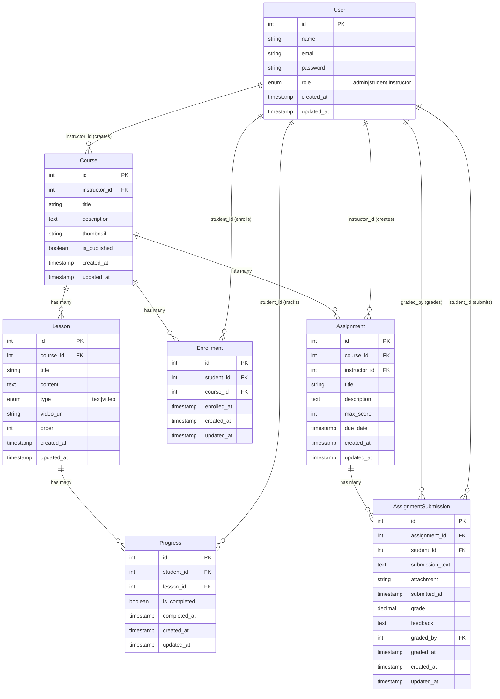

## SproutLMS Architecture Guide

This document describes how SproutLMS is put together: routes, middleware, controllers, models, Blade views, and—critically—the **data model (schema and relationships)** that powers the LMS. It is written as a practical guide for future developers working inside this Laravel 11 app.

---

## Table of Contents

1. [High-Level Overview](#high-level-overview)
2. [Domain Model & Database Schema](#domain-model--database-schema)
3. [Request Flow & Application Layers](#request-flow--application-layers)
4. [Routes, Roles & Access Control](#routes-roles--access-control)
5. [Feature Flows](#feature-flows)
6. [Project Structure & Conventions](#project-structure--conventions)
7. [Development Workflow](#development-workflow)
8. [Laravel 11+ Notes](#laravel-11-notes)
9. [Patterns & Best Practices](#patterns--best-practices)

---

## High-Level Overview

SproutLMS is a **Laravel 11** monolith that serves **Blade-based pages**. There is no public JSON API in production yet; all user interactions go through `routes/web.php` and standard session-based auth.

-   **Core idea**:
    -   **Admins** manage courses, students, and can assign instructors to courses.
    -   **Instructors** create and manage `courses`, `lessons`, and `assignments`. They can grade student submissions.
    -   **Students** can browse `courses`, enroll via `enrollments`, submit `assignments`, and their lesson completion is tracked via `progress`.
-   **Roles**:
    -   `admin`, `student`, and `instructor` are stored on the `users` table (`role` column).
    -   Custom middleware (`admin`, `instructor`, `student`) and route groups enforce permissions.
    -   **Important**: The `admin` role cannot be registered via public registration for security reasons. Admins must be created manually using Laravel Tinker (see README.md for setup instructions).
-   **Stack**:
    -   Backend: Laravel 11 (routes, controllers, models, middleware, policies).
    -   Views: Blade templates under `resources/views`.
    -   Styling: Tailwind-based CSS in `resources/css/app.css`.

At runtime, the core mental model remains:

```text
Incoming request
  → Route (web.php)
  → Middleware (auth / role)
  → Controller (Course/Lesson/Enrollment/Dashboard)
  → Eloquent models (User/Course/Lesson/Enrollment/Progress)
  → Blade view
  → HTML response
```

---

## Domain Model & Database Schema

This section documents the **actual schema and relationships** currently in the app. If you add new tables or relationships, update this section.

### User

Represents **admins**, **students**, and **instructors**.

-   **Table**: `users` (default Laravel users table plus a `role` column).
-   **Important columns**:
    -   `id` – primary key.
    -   `name`, `email`, `password`.
    -   `role` – `enum('admin', 'student', 'instructor')`, default `student`.
    -   Standard Laravel timestamps and auth-related columns.
-   **Model**: `App\Models\User`
-   **Relationships**:
    -   `courses(): HasMany<Course>` – courses authored by this user as instructor (`instructor_id`).
    -   `enrollments(): HasMany<Enrollment>` – enrollments of this user when acting as a student (`student_id`).
    -   `progress(): HasMany<Progress>` – lesson completion rows for this student (`student_id`).
    -   `assignments(): HasMany<Assignment>` – assignments created by this user as instructor (`instructor_id`).
    -   `assignmentSubmissions(): HasMany<AssignmentSubmission>` – assignments submitted by this user as student (`student_id`).
-   **Security**: The `admin` role is restricted from public registration. The `RegisterController` validates that `role` must be `in:student,instructor`, preventing admin creation through the registration form. Admins must be created manually using Laravel Tinker or database seeders.

### Course

Represents a course created by an instructor.

-   **Table**: `courses`  
    **Migration**: `2025_12_27_135659_create_courses_table.php`
-   **Columns**:
    -   `id` – primary key.
    -   `instructor_id` – `foreignId` → `users.id` (`onDelete('cascade')`).
    -   `title` – string.
    -   `description` – text, nullable.
    -   `thumbnail` – string, nullable.
    -   `is_published` – boolean, default `false`.
    -   `created_at`, `updated_at`.
-   **Model**: `App\Models\Course`
-   **Relationships**:
    -   `instructor(): BelongsTo<User>` – the instructor who owns the course.
    -   `lessons(): HasMany<Lesson>` – ordered lessons (`order` column).
    -   `enrollments(): HasMany<Enrollment>` – student enrollments for this course.
    -   `students(): BelongsToMany<User>` – students enrolled in this course, via `enrollments` pivot (`withTimestamps()`).
    -   `assignments(): HasMany<Assignment>` – assignments for this course.

### Lesson

Represents a single lesson (text or video) within a course.

-   **Table**: `lessons`  
    **Migration**: `2025_12_27_135705_create_lessons_table.php`
-   **Columns**:
    -   `id` – primary key.
    -   `course_id` – `foreignId` → `courses.id` (`onDelete('cascade')`).
    -   `title` – string.
    -   `content` – text, nullable (mainly used for text lessons).
    -   `type` – `enum('text', 'video')`, default `'text'`.
    -   `video_url` – string, nullable (used when `type = 'video'`).
    -   `order` – integer, default `0` (used for lesson ordering within a course).
    -   `created_at`, `updated_at`.
-   **Model**: `App\Models\Lesson`
-   **Relationships**:
    -   `course(): BelongsTo<Course>` – the parent course.
    -   `progress(): HasMany<Progress>` – completion records per student.

### Enrollment

Represents a student enrolled in a course.

-   **Table**: `enrollments`  
    **Migration**: `2025_12_27_135709_create_enrollments_table.php`
-   **Columns**:
    -   `id` – primary key.
    -   `student_id` – `foreignId` → `users.id` (`onDelete('cascade')`).
    -   `course_id` – `foreignId` → `courses.id` (`onDelete('cascade')`).
    -   `enrolled_at` – timestamp, defaults to current time.
    -   `created_at`, `updated_at`.
    -   **Unique index**: `unique(['student_id', 'course_id'])` – one enrollment row per student/course.
-   **Model**: `App\Models\Enrollment`
-   **Relationships**:
    -   `student(): BelongsTo<User>` – the student.
    -   `course(): BelongsTo<Course>` – the course.

### Progress

Tracks **per-student lesson completion**.

-   **Table**: `progress`  
    **Migration**: `2025_12_27_135715_create_progress_table.php`
-   **Columns**:
    -   `id` – primary key.
    -   `student_id` – `foreignId` → `users.id` (`onDelete('cascade')`).
    -   `lesson_id` – `foreignId` → `lessons.id` (`onDelete('cascade')`).
    -   `is_completed` – boolean, default `false`.
    -   `completed_at` – timestamp, nullable.
    -   `created_at`, `updated_at`.
    -   **Unique index**: `unique(['student_id', 'lesson_id'])` – one progress row per student/lesson pair.
-   **Model**: `App\Models\Progress`
-   **Relationships**:
    -   `student(): BelongsTo<User>`
    -   `lesson(): BelongsTo<Lesson>`

### Assignment

Represents an assignment created by an instructor for a course.

-   **Table**: `assignments`  
    **Migration**: `2026_01_05_061902_create_assignments_table.php`
-   **Columns**:
    -   `id` – primary key.
    -   `course_id` – `foreignId` → `courses.id` (`onDelete('cascade')`).
    -   `instructor_id` – `foreignId` → `users.id` (`onDelete('cascade')`).
    -   `title` – string.
    -   `description` – text, nullable.
    -   `max_score` – integer, default `100`.
    -   `due_date` – timestamp, nullable.
    -   `created_at`, `updated_at`.
-   **Model**: `App\Models\Assignment`
-   **Relationships**:
    -   `course(): BelongsTo<Course>` – the course this assignment belongs to.
    -   `instructor(): BelongsTo<User>` – the instructor who created the assignment.
    -   `submissions(): HasMany<AssignmentSubmission>` – student submissions for this assignment.

### AssignmentSubmission

Represents a student's submission for an assignment.

-   **Table**: `assignment_submissions`  
    **Migration**: `2026_01_05_061921_create_assignment_submissions_table.php`
-   **Columns**:
    -   `id` – primary key.
    -   `assignment_id` – `foreignId` → `assignments.id` (`onDelete('cascade')`).
    -   `student_id` – `foreignId` → `users.id` (`onDelete('cascade')`).
    -   `submission_text` – text (the submission content).
    -   `attachment` – string, nullable (URL to attached file).
    -   `submitted_at` – timestamp.
    -   `grade` – decimal, nullable (score given by instructor).
    -   `feedback` – text, nullable (instructor feedback).
    -   `graded_by` – `foreignId` → `users.id`, nullable (instructor who graded).
    -   `graded_at` – timestamp, nullable.
    -   `created_at`, `updated_at`.
    -   **Unique index**: `unique(['assignment_id', 'student_id'])` – one submission per student per assignment.
-   **Model**: `App\Models\AssignmentSubmission`
-   **Relationships**:
    -   `assignment(): BelongsTo<Assignment>`
    -   `student(): BelongsTo<User>`
    -   `grader(): BelongsTo<User>` (via `graded_by`)

### Relationship Diagram (Text View)

```text
User
  - id
  - role: 'admin' | 'student' | 'instructor'

Course
  - id
  - instructor_id → User.id

Lesson
  - id
  - course_id → Course.id

Enrollment
  - id
  - student_id → User.id
  - course_id  → Course.id
  - UNIQUE (student_id, course_id)

Progress
  - id
  - student_id → User.id
  - lesson_id  → Lesson.id
  - UNIQUE (student_id, lesson_id)

Assignment
  - id
  - course_id → Course.id
  - instructor_id → User.id

AssignmentSubmission
  - id
  - assignment_id → Assignment.id
  - student_id → User.id
  - graded_by → User.id (nullable)
  - UNIQUE (assignment_id, student_id)
```

In terms of relationships:

-   A **User (admin)** can manage all courses and students.
-   A **User (instructor)** **has many** `Course` and **has many** `Assignment`.
-   A **Course** **has many** `Lesson` and **has many** `Assignment`.
-   A **User (student)** **has many** `Enrollment` and **many** `Course` **through** `Enrollment`.
-   A **User (student)** **has many** `Progress` and **many** `Lesson` **through** `Progress`.
-   A **User (student)** **has many** `AssignmentSubmission`.
-   An **Assignment** **has many** `AssignmentSubmission`.

### Entity Relationship Diagram (Visual)



---

## Request Flow & Application Layers

SproutLMS follows a standard Laravel layered approach.

-   **Routes** (`routes/web.php`):
    -   All web routes live here (no production `routes/api.php` yet).
    -   Route groups apply `auth`, `admin`, `instructor`, and `student` middleware.
-   **Middleware**:
    -   Laravel's built-in session/auth middleware.
    -   Custom role middleware (aliased as `admin`, `instructor`, `student` in `bootstrap/app.php`).
-   **Controllers** (`app/Http/Controllers`):
    -   `Auth\LoginController`, `Auth\RegisterController` – authentication.
    -   `DashboardController` – role-aware dashboard (redirects admins to `/admin`).
    -   `AdminController` – admin dashboard and student management.
    -   `CourseController` – browse courses, instructor/admin CRUD, public show page.
    -   `LessonController` – nested lesson management and lesson viewing.
    -   `EnrollmentController` – enrollments CRUD for students.
    -   `AssignmentController` – assignment management for instructors.
    -   `AssignmentSubmissionController` – assignment submission and grading.
-   **Models** (`app/Models`):
    -   `User`, `Course`, `Lesson`, `Enrollment`, `Progress` – each with relationships defined.
-   **Views** (`resources/views`):
    -   `landing`, `auth/*`, `courses/*`, `lessons/*`, `dashboard/*`, `enrollments/*`, `admin/*`, `assignments/*`, `layouts/*`.

Example end-to-end flow for viewing a lesson as a student:

```text
GET /courses/{course}/lessons/{lesson}
  → Route in routes/web.php within auth group
  → auth middleware ensures the user is logged in
  → LessonController@show(Course $course, Lesson $lesson)
      - If role = student:
          - check that an Enrollment exists for (student_id, course_id)
          - if not enrolled, redirect back to course with an error
          - if enrolled, upsert Progress row (mark lesson completed)
      - If role = instructor:
          - ensure the instructor owns the course
      - load previous/next lesson for navigation
      - return 'lessons.show' with lesson, course, prev/next
  → Blade renders the lesson page for the student
```

---

## Routes, Roles & Access Control

All routes are defined in `routes/web.php`. Route ordering is important to prevent conflicts between static and dynamic paths.

### Public Routes

-   **Landing & auth**:
    -   `/` – landing page (`landing.blade.php`).
    -   `/login` (GET) – `LoginController@showLoginForm`.
    -   `/login` (POST) – `LoginController@login`.
    -   `/logout` (POST) – `LoginController@logout`.
    -   `/register` (GET) – `RegisterController@showRegistrationForm`.
    -   `/register` (POST) – `RegisterController@register` (only allows `student` or `instructor` roles; `admin` is restricted).
-   **Course browsing**:
    -   `/courses/browse` (GET) – `CourseController@browse` (only published courses).
    -   `/courses/{course}` (GET) – `CourseController@show` (course details; must be **after** all `/courses/*` static routes).

### Authenticated Routes (`auth` middleware)

All of the following live inside:

```php
Route::middleware('auth')->group(function () {
    // ...
});
```

-   **Dashboard**:

    -   `/dashboard` (GET) – `DashboardController@index`
        -   If `role = admin`: redirects to `/admin`.
        -   If `role = instructor`: show teaching stats and courses.
        -   If `role = student`: show enrolled courses and progress stats.

-   **Admin routes** (`middleware('admin')`):

    -   `/admin` (GET) – `AdminController@index` (admin dashboard with statistics).
    -   `/admin/students` (GET) – `AdminController@students` (list all students).
    -   `/admin/students/create` (GET) – `AdminController@createStudent` (create student form).
    -   `/admin/students` (POST) – `AdminController@storeStudent` (create student).
    -   `/admin/students/{student}` (GET) – `AdminController@showStudent` (view student details).
    -   `/admin/students/{student}/edit` (GET) – `AdminController@editStudent` (edit student form).
    -   `/admin/students/{student}` (PUT) – `AdminController@updateStudent` (update student).
    -   `/admin/students/{student}` (DELETE) – `AdminController@destroyStudent` (delete student).
    -   `/admin/students/{student}/enroll/{course}` (POST) – `AdminController@enrollStudent` (enroll student in course).
    -   `/admin/students/{student}/unenroll/{course}` (DELETE) – `AdminController@unenrollStudent` (unenroll student).

-   **Instructor/Admin course management** (`middleware(['admin', 'instructor'])`):

    -   `/courses` (GET) – instructor’s own courses (`CourseController@index`).
    -   `/courses/create` (GET) – course create form (`CourseController@create`).
    -   `/courses` (POST) – create course (`CourseController@store`).
    -   `/courses/{course}/edit` (GET) – edit form (`CourseController@edit`).
    -   `/courses/{course}` (PUT) – update course (`CourseController@update`).
    -   `/courses/{course}` (DELETE) – delete course (`CourseController@destroy`).

-   **Lessons nested under courses**:

    -   Prefix: `courses/{course}`.
    -   Instructor/Admin-only lesson management (`middleware(['admin', 'instructor'])`):
        -   `/lessons/create` (GET) – `LessonController@create`.
        -   `/lessons` (POST) – `LessonController@store`.
        -   `/lessons/{lesson}/edit` (GET) – `LessonController@edit`.
        -   `/lessons/{lesson}` (PUT) – `LessonController@update`.
        -   `/lessons/{lesson}` (DELETE) – `LessonController@destroy`.
    -   Lesson viewing (authenticated, with role checks in controller):
        -   `/lessons/{lesson}` (GET) – `LessonController@show`.

-   **Assignments nested under courses**:

    -   Prefix: `courses/{course}`.
    -   Instructor/Admin-only assignment management (`middleware(['admin', 'instructor'])`):
        -   `/assignments` (GET) – `AssignmentController@index` (list assignments).
        -   `/assignments/create` (GET) – `AssignmentController@create`.
        -   `/assignments` (POST) – `AssignmentController@store`.
        -   `/assignments/{assignment}/edit` (GET) – `AssignmentController@edit`.
        -   `/assignments/{assignment}` (PUT) – `AssignmentController@update`.
        -   `/assignments/{assignment}` (DELETE) – `AssignmentController@destroy`.
    -   Assignment viewing (accessible to enrolled students and instructors):
        -   `/assignments/{assignment}` (GET) – `AssignmentController@show`.
    -   Student assignment submission (`middleware('student')`):
        -   `/assignments/{assignment}/submit` (POST) – `AssignmentSubmissionController@store`.
    -   Instructor/Admin grading (`middleware(['admin', 'instructor'])`):
        -   `/assignments/{assignment}/submissions/{submission}` (PUT) – `AssignmentSubmissionController@update` (grade submission).

-   **Student enrollment routes** (`middleware('student')`):
    -   `/courses/{course}/enroll` (POST) – enroll in a course (`EnrollmentController@store`).
    -   `/courses/{course}/enroll` (DELETE) – unenroll (`EnrollmentController@destroy`).
    -   `/enrollments` (GET) – list of a student’s enrollments (`EnrollmentController@index`).

### Role Enforcement

-   **Global auth**:
    -   `Route::middleware('auth')` wraps all dashboards, course management, lessons, assignments, and enrollment routes.
-   **Role-specific middleware** (registered as aliases):
    -   `admin` – only users with `role = 'admin'`.
    -   `instructor` – only users with `role = 'instructor'`.
    -   `student` – only users with `role = 'student'`.
-   **Ownership checks inside controllers**:
    -   Admins can bypass ownership checks for courses, lessons, and assignments.
    -   For instructors: `CourseController@edit/update/destroy` and all lesson/assignment CRUD verify `Auth::id() === $course->instructor_id` (unless admin).
    -   `LessonController@show` and `AssignmentController@show` check:
        -   Students must have an `Enrollment` for the course.
        -   Instructors must own the course (or be admin).
-   **Admin Registration Restriction**:
    -   The `RegisterController` validates that `role` must be `in:student,instructor`, preventing admin creation through public registration.
    -   Admins must be created manually using Laravel Tinker (see README.md for instructions).
    -   **Why Tinker?** Laravel Tinker is Laravel's REPL (Read-Eval-Print Loop) that provides an interactive shell to interact with your Laravel application. It allows you to execute PHP code directly against your application's models and database, making it the ideal tool for creating admin users securely without exposing admin creation to the public registration form.

---

## Feature Flows

This section ties the schema and routing together for common user journeys.

### 1. Authentication & Registration

-   **Register**:
    -   `RegisterController@register` validates `name`, `email`, `password`, and `role`.
    -   **Important**: The `role` validation restricts values to `in:student,instructor`, preventing admin registration.
    -   Creates a `User` with a hashed password and chosen role.
    -   Logs the user in and redirects to `/dashboard`.
-   **Admin Creation**:
    -   Admins cannot be created via public registration for security reasons.
    -   Use Laravel Tinker: `php artisan tinker`, then `User::create([...])` with `role => 'admin'`.
    -   See README.md for detailed instructions.
-   **Login**:
    -   `LoginController@login` validates credentials and calls `Auth::attempt`.
    -   On success, regenerates the session and redirects to the intended page or `/dashboard`.
    -   Admins are automatically redirected to `/admin` dashboard.
-   **Logout**:
    -   `LoginController@logout` logs the user out and invalidates the session.

### 2. Instructor: Course & Lesson Management

-   **List own courses**:
    -   `GET /courses` → `CourseController@index`.
    -   Filters `Course` by `instructor_id = Auth::id()`.
    -   Uses `withCount(['lessons', 'enrollments'])` to display counts.
-   **Create course**:
    -   `GET /courses/create` → `CourseController@create` (form).
    -   `POST /courses` → `CourseController@store`.
    -   Validates title, description, thumbnail; sets `instructor_id` and `is_published = false`.
    -   Redirects to `courses.show` with a success flash.
-   **Edit, update, delete course**:

    -   `GET /courses/{course}/edit` → `CourseController@edit` (with ownership check).
    -   `PUT /courses/{course}` → `CourseController@update`.
    -   `DELETE /courses/{course}` → `CourseController@destroy`.

-   **Lesson CRUD (inside a course)**:
    -   `GET /courses/{course}/lessons/create` → `LessonController@create`.
    -   `POST /courses/{course}/lessons` → `LessonController@store`:
        -   Validates `title`, `content`, `type`, `video_url`, `order`.
        -   If `order` is missing, appends after the current max.
    -   `GET /courses/{course}/lessons/{lesson}/edit` → `LessonController@edit`.
    -   `PUT /courses/{course}/lessons/{lesson}` → `LessonController@update`.
    -   `DELETE /courses/{course}/lessons/{lesson}` → `LessonController@destroy`.

### 3. Admin: Course and Student Management

-   **Admin Dashboard**:
    -   `GET /admin` → `AdminController@index`.
    -   Displays statistics: total students, instructors, courses, enrollments.
-   **Student Management**:
    -   `GET /admin/students` → `AdminController@students` (list all students).
    -   `GET /admin/students/create` → `AdminController@createStudent` (form).
    -   `POST /admin/students` → `AdminController@storeStudent` (create student account).
    -   `GET /admin/students/{student}` → `AdminController@showStudent` (view student with enrollments).
    -   `GET /admin/students/{student}/edit` → `AdminController@editStudent` (form).
    -   `PUT /admin/students/{student}` → `AdminController@updateStudent` (update student).
    -   `DELETE /admin/students/{student}` → `AdminController@destroyStudent` (delete student).
    -   `POST /admin/students/{student}/enroll/{course}` → `AdminController@enrollStudent` (enroll student).
    -   `DELETE /admin/students/{student}/unenroll/{course}` → `AdminController@unenrollStudent` (unenroll student).
-   **Course Management**:
    -   Admins can view, create, edit, and delete all courses (bypass ownership checks).
    -   When creating/editing courses, admins can assign any instructor via `instructor_id` dropdown.

### 4. Student: Browsing, Enrolling, Progress, and Assignments

-   **Browse courses**:
    -   `GET /courses/browse` → `CourseController@browse`.
    -   Lists only `is_published = true` courses with instructor and lesson counts.
-   **View course details**:
    -   `GET /courses/{course}` → `CourseController@show`.
    -   Loads course with `instructor` and ordered `lessons`.
    -   For authenticated students, computes `isEnrolled` by checking `enrollments`.
-   **Enroll in a course**:
    -   `POST /courses/{course}/enroll` → `EnrollmentController@store`.
    -   Requires `student` middleware; prevents duplicates via both a query and DB unique index.
    -   Creates an `Enrollment` row and redirects back to the course show page.
-   **Unenroll from a course**:
    -   `DELETE /courses/{course}/enroll` → `EnrollmentController@destroy`.
-   **View enrollments**:

    -   `GET /enrollments` → `EnrollmentController@index`.
    -   Loads a student’s `Enrollment` rows with associated `Course` and `lessons_count`.

-   **View lesson and track completion**:
    -   `GET /courses/{course}/lessons/{lesson}` → `LessonController@show`.
    -   Students must be enrolled; instructors must own the course.
    -   For students, `Progress::updateOrCreate` is used to mark completion and set `completed_at`.
    -   Previous/next lesson links are computed for navigational UX.
-   **View and submit assignments**:
    -   `GET /courses/{course}/assignments/{assignment}` → `AssignmentController@show`.
    -   Students can view assignments for enrolled courses.
    -   `POST /courses/{course}/assignments/{assignment}/submit` → `AssignmentSubmissionController@store`.
    -   Students submit `submission_text` and optional `attachment` URL.
    -   After submission, students can view their graded submission with feedback.

### 5. Instructor: Assignment Creation and Grading

-   **Create assignments**:
    -   `GET /courses/{course}/assignments/create` → `AssignmentController@create`.
    -   `POST /courses/{course}/assignments` → `AssignmentController@store`.
    -   Validates `title`, `description`, `max_score`, `due_date`.
-   **Grade submissions**:
    -   `GET /courses/{course}/assignments/{assignment}` → `AssignmentController@show`.
    -   Instructors see all student submissions for the assignment.
    -   `PUT /courses/{course}/assignments/{assignment}/submissions/{submission}` → `AssignmentSubmissionController@update`.
    -   Instructors provide `grade` (score) and `feedback` (text).
    -   System records `graded_by` and `graded_at` timestamps.

### 6. Dashboards

-   **Admin dashboard**:
    -   `DashboardController@index` for `role = admin` redirects to `/admin`.
    -   `AdminController@index` displays:
        -   Total students, instructors, courses, enrollments.
        -   Recent students list.
    -   Renders `admin.dashboard`.
-   **Instructor dashboard**:
    -   `DashboardController@index` for `role = instructor`.
    -   Fetches all of the instructor's courses with:
        -   `withCount('lessons')`
        -   `withCount('enrollments')`
    -   Computes total distinct students across all these courses using `Enrollment`.
    -   Renders `dashboard.instructor`.
-   **Student dashboard**:
    -   `DashboardController@index` for `role = student`.
    -   Fetches enrollments and each course's `lessons_count`.
    -   Counts completed lessons via `Progress` (`is_completed = true`).
    -   Renders `dashboard.student`.

---

## Project Structure & Conventions

### Key Directories

```text
lms-app/
├── app/
│   ├── Http/
│   │   ├── Controllers/          # Auth, Course, Lesson, Enrollment, Dashboard
│   │   └── Middleware/           # Role middleware, etc.
│   ├── Models/                   # User, Course, Lesson, Enrollment, Progress
│   ├── Policies/                 # Authorization policies (e.g., CoursePolicy)
│   └── Providers/                # Service providers
│
├── resources/
│   ├── views/
│   │   ├── auth/                 # Login/Register
│   │   ├── courses/              # Course list, show, create, edit
│   │   ├── lessons/              # Lesson show, create, edit
│   │   ├── dashboard/            # Student & instructor dashboards
│   │   ├── enrollments/          # Student enrollments
│   │   ├── admin/                # Admin dashboard and student management
│   │   ├── assignments/          # Assignment views (list, create, edit, show)
│   │   ├── layouts/              # Shared layout(s)
│   │   └── landing.blade.php     # Landing page
│   ├── css/
│   │   └── app.css               # Tailwind & design tokens
│   └── js/
│       └── app.js                # JavaScript entry
│
├── routes/
│   └── web.php                   # Web routes
│
├── database/
│   └── migrations/               # All DB schema, including LMS tables
│
└── public/
    └── index.php                 # Laravel front controller
```

### Naming & Organization

-   **Controllers**: `PascalCase` + `Controller` (e.g., `CourseController`, `LessonController`).
-   **Models**: `PascalCase`, singular (e.g., `Course`, `Lesson`, `Enrollment`).
-   **Views**: `kebab-case` (e.g., `course-show.blade.php`, `lesson-edit.blade.php`).
-   **Routes**: Kebab-case URLs (e.g., `/courses/browse`, `/enrollments`).
-   **Migrations**: Timestamp prefix + snake_case (e.g., `2025_12_27_135705_create_lessons_table.php`).
-   **Views by feature**: group by domain (`courses/`, `lessons/`, `dashboard/`, etc.).

---

## Development Workflow

Use this checklist when adding or changing features:

-   **1. Model & schema first (when needed)**:

    -   Decide which entities are involved (`Course`, `Lesson`, `Enrollment`, `Progress`, `Assignment`, `AssignmentSubmission`, `User`).
    -   Create or update migrations and models as needed.
    -   Update the **Domain Model & Database Schema** section of this document if you introduce new tables or relations.

-   **2. Plan routes & permissions**:

    -   Add new routes to `routes/web.php`.
    -   Group under `auth`, `admin`, `instructor`, or `student` middleware as required.
    -   Keep static routes (`/courses/browse`, `/courses/create`) above parameterized ones (`/courses/{course}`).
    -   Remember: Admins can bypass ownership checks in controllers.

-   **3. Implement controllers**:

    -   Validate request data using `$request->validate([...])`.
    -   Use Eloquent relationships (`$course->lessons()`, `$user->enrollments()`) and `with()/withCount()` to avoid N+1 queries.
    -   Keep controllers thin: fetch/persist data, then hand it to views.

-   **4. Build or adjust Blade views**:

    -   Extend shared layout(s) with `@extends('layouts.app')`.
    -   Use the data the controller passes into the view; avoid hard-coded/fake data.
    -   Follow the existing Tailwind-based design and component patterns.

-   **5. Test in the browser**:
    -   Test each new route as:
        -   Guest
        -   Student
        -   Instructor
        -   Admin (create admin user using Tinker first - see README.md)
    -   Confirm redirects, 403s, and visibility of buttons/links match role and state.
    -   Run `php artisan route:list` to verify routes and middleware are configured correctly.

---

## Laravel 11+ Notes

-   **Middleware in routes, not controllers**:

    -   Do not call `$this->middleware()` inside controller constructors.
    -   Instead, wrap routes in `Route::middleware('auth')` and `Route::middleware('instructor')`/`Route::middleware('student')` as shown in `routes/web.php`.

-   **Route model binding**:

    -   Use typed parameters like `Course $course`, `Lesson $lesson`, etc.
    -   Ensure route placeholders match parameter names (`/courses/{course}` → `Course $course`).
    -   This simplifies controllers and keeps them aligned with the schema.

-   **Auth**:
    -   Currently uses the `web` guard and session-based auth only.
    -   For future API work, see `docs/api.md` (Sanctum-based plan).
-   **Admin Creation**:
    -   Admins cannot be registered via public registration form.
    -   Use Laravel Tinker: `php artisan tinker` to create admin users manually.
    -   Tinker is Laravel's REPL (Read-Eval-Print Loop) that provides an interactive shell to execute PHP code against your application.
    -   Example: `User::create(['name' => 'Admin', 'email' => 'admin@example.com', 'password' => Hash::make('password'), 'role' => 'admin'])`
    -   This restriction exists for security: preventing unauthorized admin account creation through public registration.

---

## Patterns & Best Practices

### Route Ordering

-   Always define routes in this relative order:
    1. Static URLs (e.g., `/courses/browse`, `/courses/create`).
    2. Nested static URLs (e.g., `/courses/{course}/lessons/create`).
    3. Parameterized URLs (e.g., `/courses/{course}`, `/courses/{course}/lessons/{lesson}`).
-   This prevents `/courses/{course}` from capturing paths that should map to `/courses/create`, `/courses/browse`, etc.

### Thin Controllers, Rich Models

-   Controllers should:
    -   Validate and authorize.
    -   Use models and relationships for queries.
    -   Pass data to views and decide where to redirect.
-   Prefer:
    -   `Course::where('instructor_id', Auth::id())->withCount('lessons')->get();`
    -   `$course->lessons()->orderBy('order')->get();`
    -   `$course->enrollments()->with('student')->get();`

### Use Relationships and Aggregates

-   Use `with()`, `withCount()`, and `load()` to:
    -   Avoid N+1 query issues.
    -   Compute stats (e.g., lessons_count, enrollments_count) efficiently.
-   Examples in production code:
    -   `CourseController@index/browse/show`.
    -   `DashboardController@index`.
    -   `EnrollmentController@index`.

### Consistent Authorization

-   Enforce coarse-grained role checks with middleware (`auth`, `instructor`, `student`).
-   Use simple ownership checks inside controllers (`Auth::id() === $course->instructor_id`) before mutating course/lesson data.
-   For more complex rules, consider formalizing them in policies (e.g., `CoursePolicy`).

### Keep This Document Current

Whenever you:

-   Add a new model/table.
-   Introduce a new relationship or pivot.
-   Add a major feature (e.g., quizzes, certificates, assessments).

You should:

-   Update the **Domain Model & Database Schema** section with any new tables/fields/relationships.
-   Update **Feature Flows** for new user journeys.

This architecture guide is meant to be the first stop for new contributors and a shared understanding of how SproutLMS hangs together end-to-end.
